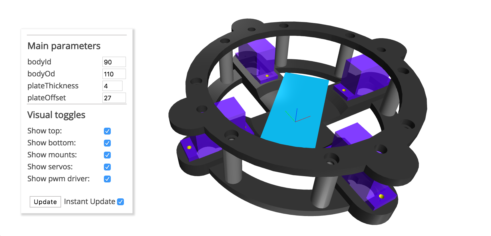

# Isolos

>*Isolos* is a simple quadruped, 3d printable robot designed in OpenJSCAD

## Table of Contents

- [Usage](#usage)
- [License](#license)
- [Screenshots](#screenshots)

## Usage

This package can currently only be used in the desktop version of OpenJSCAD (written as npm module)

>NOTE: at this time, only the body of the robot is available

## License

[The MIT License (MIT)](./LICENSE)
(unless specified otherwise)

## Screenshots

